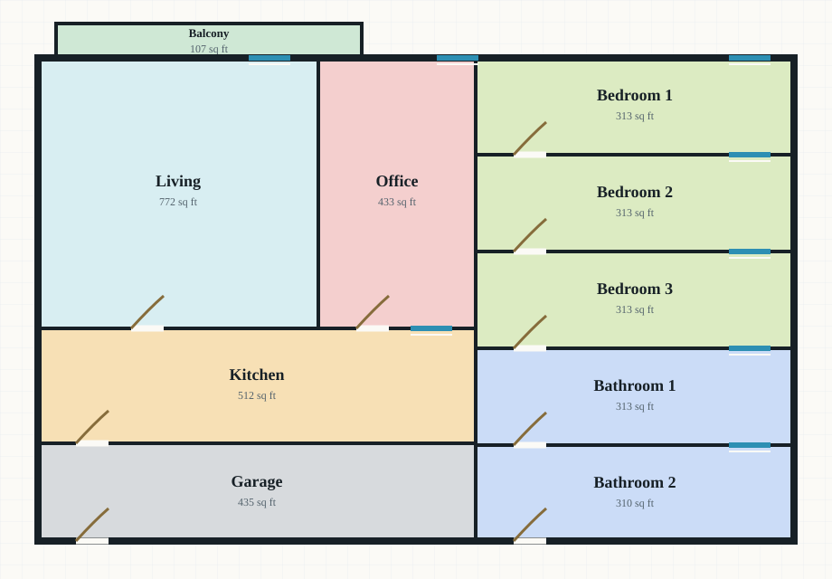

# Athena

Athena is a student project that generates simple architectural floorplan blueprints from text descriptions. The goal of the project is to take a sentence describing a home or apartment layout and turn it into a blueprint-style image.

This project includes a basic demo interface, a command-line tool, and an experimental machine-learning pipeline for preparing data, training a model, evaluating it, and generating blueprint images.

## Tools Used

- Python
- PyTorch
- TorchVision
- Hugging Face Transformers
- Pandas
- NumPy
- Pillow
- Matplotlib
- scikit-image
- HTML/CSS for the simple demo page

## Sample Example

**Text description:**

```text
Three bedroom house with two bathrooms, an office, a garage, and a balcony.
```

**Generated result:**


